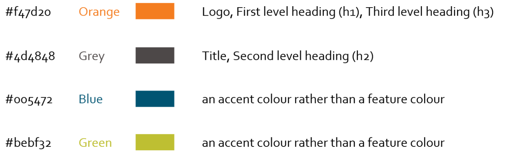

---
title: DS Handbook style guide
description: Style guidelines for Data Steward Handbook
contributors: [Marina Popleteeva, Helena Schnitzer, Bojan Kverh, Flavio Licciulli, Carmen Reverté, Diana Pilvar]
page_id: style_guide
---  

# Style guide  

This style guide is adopted from [RDMkit](https://rdmkit.elixir-europe.org/style_guide) that in turn follows the European Commission’s [Web Writing Style Guide](https://wikis.ec.europa.eu/display/WEBGUIDE/02.+Web+writing+guidelines) and the more detailed [English Style Guide](https://commission.europa.eu/system/files/2023-01/styleguide_english_dgt_en.pdf). Below are the points that you might find most useful.  

## General style and tone    
  
- Keep the tone friendly rather than formal, and use “you”. Imagine you were explaining something verbally to someone - how would you say it?  
- Use short, active sentences and short paragraphs (3-4 sentences).
- Make use of headings and bullet points to break text up so it is easy to scan.    
- Remember that the Handbook is there to help people, so make it clear to the readers how the information can benefit them.  
- Use the words your readers would use. Think of the terms they would use when searching for their problem, and use those terms.  
- We promote using diagrams and figures to make it easier for readers to capture the content.  
For text, use English following [RDMkit style guide](https://rdmkit.elixir-europe.org/style_guide#text).

## Graphic design
- **White space**: make sure there is plenty of space so that the main elements stand out and the text does not appear overwhelming.

- **Colours**:  
  - We use ELIXIR colours described in “[The ELIXIR brand guidelines and best practices](https://drive.google.com/file/d/0B7btK9HAXhx1LVVCS3pBZVI1SjQ/view?resourcekey=0-KzdprazYmQ35mcod7NwS8w)”.  
  - The headings and text will automatically appear in the right colour, font and size  if you use the [page template](https://docs.google.com/document/d/1W8Q2dnsjb2KdubVHjqN6rTDC2Bc1vkJG4w9emtUSKdg).  
  - Use only the following colours in the design, text and illustrations of the Handbook.

  
  
  - **Fonts**: the main ELIXIR font is Corbel.  
